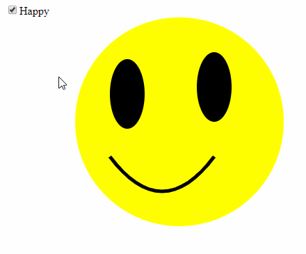

# Homework 1

To complete this homework you should have a [`github`](https://github.com/) account with [free account upgrade](https://github.com/edu) approved and [`git`](https://git-scm.com/downloads) installed and configured as described in Pravtice 1.

## Task
Using template from this repository create checkbox which will switch:
* its lable content `Happy/Sad`;
* position of `<path>` element.

Final result should works like this:

Since we have two possible states here this task can be completed without using JavaScript.

**This task should be completed using a pure JavaScript and/or CSS without using any third-party libraries**

After you'll complete requirements you should `push` your changes to your `github` repo, configure `Github Pages` for this repo and sand a link to the application via Telegram @PapaKKKarl or email egoriv1802@gmail.com