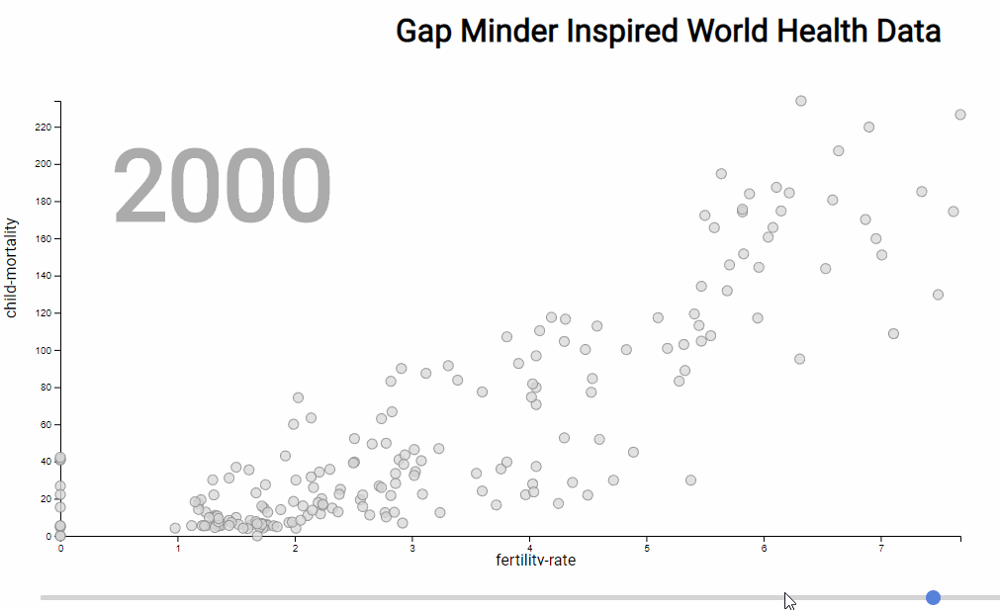
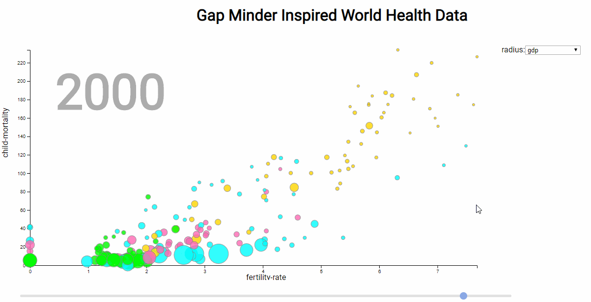
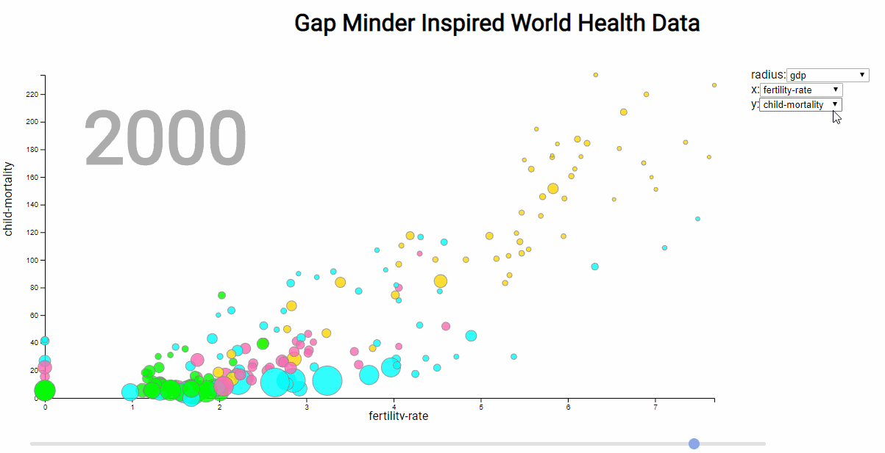

# HW 2

Objectives of this assignment:
- practice with selections, scalex and axes in d3;
- practice with reading the state of `DOM` elements, add and modify it.

This template includes styles and script structure. You can change it if you want, there are only functional requirements.


Files contain notes for each part of the assignment. Most of them are in `js/script.js`.

Elements in the data set contain information about a specific country with its various indicators in different years. Each object in the set has the following structure:
```JavaScript
    {
        child-mortality: {1800: …}
        country: "Afghanistan"
        fertility-rate: {1800: …}
        gdp: {1800: …}
        geo: "afg"
        life-expectancy: {1800: …}
        population: {1800: …}
        region: "asia"
    }
```
This work consists of three parts. When completing each subsequent, the functionality of the previous one must be preserved. Depending on how many parts you'll successfully complete, you'll get `50`, `75` or `100` points.

## Part 1
- set axis positions;
- implement `domain` update for scales;
- create & update points on chart



## Part 2
- create two more scales for points size and color;
- implement adding an options to poinsts size selector and event handler;
- change points adding function to map new parameters;



## Part 3
- add two more selectors for axis parameters

The final result should look like this:
