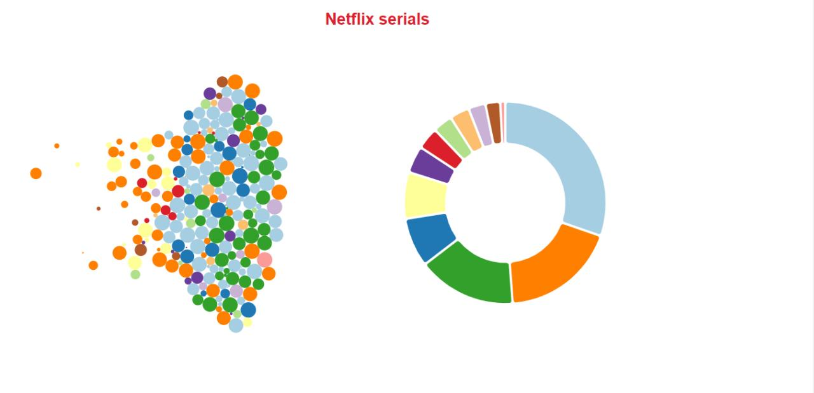
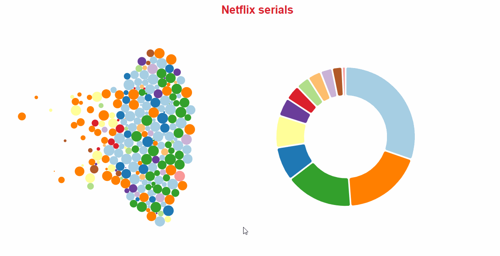
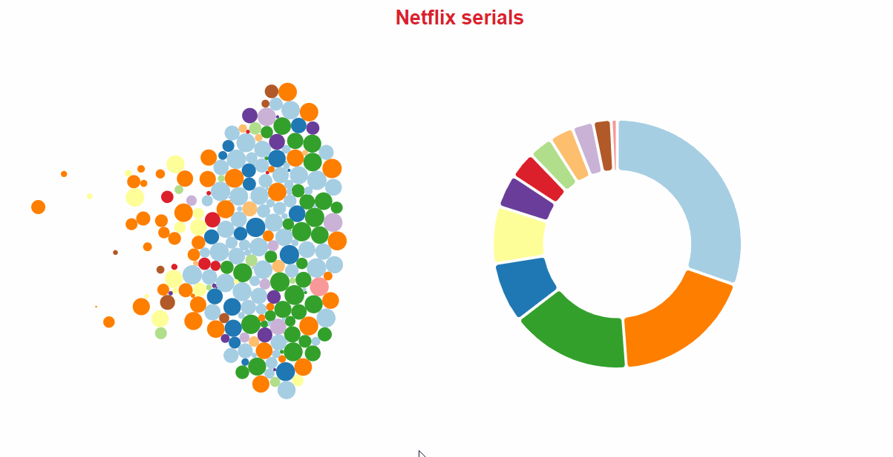

# HW 3

Goals:

- Practice on creation charts with `d3` layouts
- Practice on creation an interactivity

This repo contain a data and a template with comments needed for visualisation. If you'll follow the template you'll need to make
changes only to `js/script.js` file. The assignment contain three parts and will rated in `50`, `75` and `100` points depending on
a number of completed parts.

## Data

The data is contain information about Netflix serials from 1940 to 2017 years. We'll work with a followin fields:

- title
- rating(local age rating identifier)
- user rating score
- release year

## PART 1
Make two charts in existing `svg` containers:

1. Bubble chart, on which `release year` mapped to `x` position, `user rating score` mapped to the size of the circle and `rating`
mapped to a color of the circle.
2. Donut chart on sorted array of total serials of every `rating`.

## PART 2

1. Add highlighting a circle on bubble chart on `mouseover` with a `stroke`.
2. Add highlighting an arc on donut chart on `mouseover` with a lower `opacity`.
3. Add highlighted `rating` identifier to the element at the center of donut chart.

## PART 3

1. Change `visibility`, position and content of tooltip based on highlighted circle data.
2. Highlight the circles on bubble chart with identifier same as the highlighted arc.

## Resources

- [bubble-chart](https://bl.ocks.org/d3indepth/fee5ce57c3fc3e94c3332577d1415df4)
- [donut-chart](https://www.d3-graph-gallery.com/graph/donut_basic.html)
- [tooltip](http://bl.ocks.org/biovisualize/1016860)
