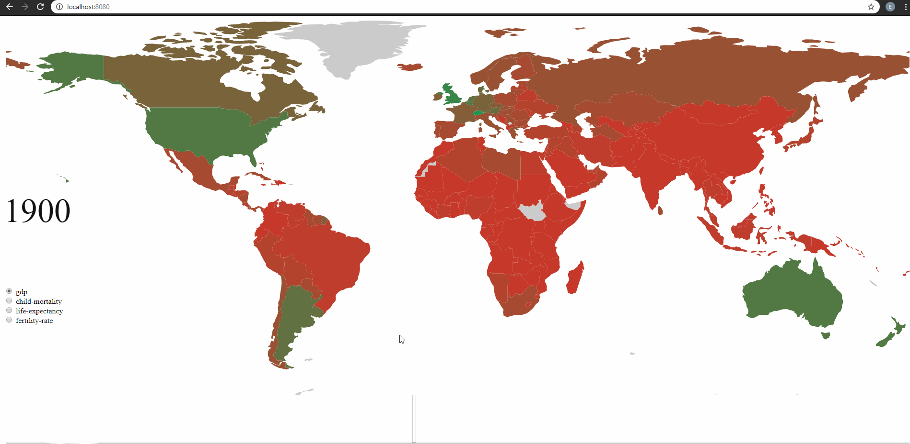
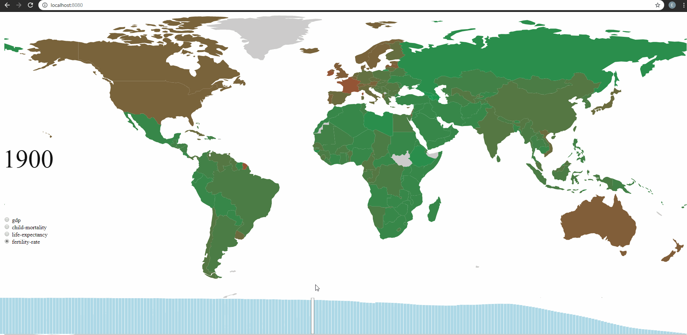
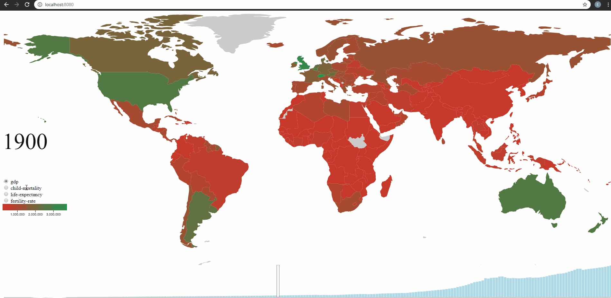

# HW 4

Goals:

- Practice with geospatial data

The assignment contain three parts and will rated in `50`, `75` and `100` points depending on a number of completed parts.

## Data

In this assignment we'll work with the same data as in `hw2` with the information about a specific country with its various indicators in different years.

## Part 1

- draw a map in the svg using `geoEquirectangular` projection
- fill the path of the country using a color scale based on chosen indicator
- show a name of the country on mouseover and hide on mouseout 

## Part 2

- construct a barchart based on a total chosen indicator value for each year
- make a smooth interpolation between the states of a bars when indicator changes

## Part 3

- make a legend with a linear gradient and dynamic axis change when indicator changes

## Resources

- [smooth barchart update](https://www.d3-graph-gallery.com/graph/barplot_button_data_hard.html);
- [legend](https://bl.ocks.org/duspviz-mit/9b6dce37101c30ab80d0bf378fe5e583).