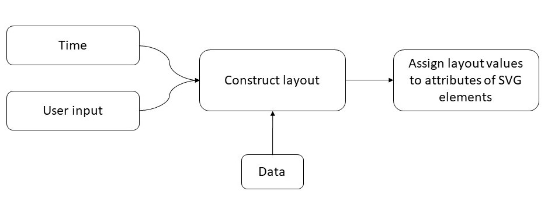

# PRACTICE 2

## Data visualisation process

Here is a schema of data visualisation process using an SVG.


* User input can be accessed usind varius DOM events such as changing the value and/or state of standard input elements, mouse events, keyboard, etc.
* Layout is a certain representation of some data. Constructing a layout for visualisation can include filtering, aggregation, calculation additional values, ect.  
* The Data binding process is about binding a certain layout element to corresponding DOM nodes and transforming its attributes values to a certain properties of DOM node.

## D3

[D3js](https://d3js.org/) (Data-Driven Documents) is a JavaScript library for manipulating documents based on data. D3 supports all of the stages of data visualisation process described above. At this practice we will be cover D3 instruments supporting a data binding process.

### How to use D3 in your project?

We can add D3 from `d3js.org` using an external link:
```html
<script src="https://d3js.org/d3.v5.min.js"></script>
```
Or [download](https://github.com/d3/d3/releases), unzip d3 to your project dependencies folder and use an relative external link:
```html
<script src="/src/d3/d3.min.js"></script>
```

### Fetch Data

[D3-fetch](https://github.com/d3/d3-fetch) build on top of [Fetch](https://fetch.spec.whatwg.org/) method and provides additional parsing of fetched data. If you fetch row data in formats like `csv`, `dsv`, `tsv`, it will automatically parse it and returns an array of object representing the rows of requested dataset.

All of modules of `d3-fetch` return [`Promise`](https://developer.mozilla.org/en-US/docs/Web/JavaScript/Reference/Global_Objects/Promise). Promise is same as [`async function`](https://developer.mozilla.org/en-US/docs/Web/JavaScript/Reference/Statements/async_function) return the object representing completion (or failure) of an asynchronous operation, and its resulting value. Once then the `Promise` object turns into `resolve` state it will automatically call `then` function or `catch` if it turns into `reject`. In our case if request was ended with success it will call `then` function with our data as the only argument.
```javascript
d3.csv("/data/employees.csv").then(function(data) {
    for (var i = 0; i < data.length; i++) {
        console.log(data); // [{name: "foo"},{name: "bar"},...]
    }
});
```

You can also use `Promise` insight the `async` function using `await` keyword to make execution flow wait until `Promise` will finish execution and return its value:
```javascript
(async () => {
  let data = await d3.csv("/data/employees.csv");
  console.log(data); // [{name: "foo"},{name: "bar"},...]
})();
```

### Selections

D3 supports a declarative approach for workin with selections of nodes. For example the following code will set color to blue in all nodes in the selection:
```javascript
d3.selectAll("p").style("color", "blue");
```
And it will stil work the same on a single node selection:
```javascript
d3.select("body").style("background-color", "black");
```

All the attributes and properties can also be defined as a functions of data. To have a data item value inside function we first need to bind the data.
```javascript
// here we assign a r attribute value of firs data.length circles in first svg in our document to age parameter of corresponding element in data array
d3.select("svg").selectAll("circle")
        .data(data).attr("r", function(d){ return d.age });
```

#### Enter and Exit selections

Using D3’s enter and exit selections, you can create new nodes for incoming data and remove outgoing nodes that are no longer needed.

When data is bound to a selection, each element in the data array is paired with the corresponding node in the selection. If there are fewer nodes than data, the extra data elements form the enter selection, which you can instantiate by appending to the enter selection:
```javascript
// if we don't have any circles in svg yet
d3.select("svg").selectAll("circle")
        .data(data).enter()
        .append().attr("r", function(d){ return d.age });
```

A common pattern is to break the initial selection into three parts and define logic for each one:

```javascript
// Update nodes
var p = d3.select("svg")
  .selectAll("circle")
  .data(employees)
    .attr('cx', function(d) { return d.age; })
    .attr('cy', function(d) { return d.experience; })
    .attr('r', function(d) { return d.salary; });

// Create nodes 
p.enter().append("circle")
    .attr('cx', function(d) { return d.age; })
    .attr('cy', function(d) { return d.experience; })
    .attr('r', function(d) { return d.salary; });


// Remove nodes
p.exit().remove();
```

### Scales

[Sacels](https://github.com/d3/d3-scale) is used for mapping data dimensions to certain visual encoding.

D3 has many different types of scales. Here are the most common:

- [Linear](https://github.com/d3/d3-scale#linear-scales)
- [Orginal](https://github.com/d3/d3-scale#ordinal-scales)
- [Pow](https://github.com/d3/d3-scale#power-scales)
- [Log](https://github.com/d3/d3-scale#log-scales)
- [Band](https://github.com/d3/d3-scale#band-scales)
- [Time](https://github.com/d3/d3-scale#scaleTime)

Here is an example of using linear scale:
```javascript
var x = d3.scaleLinear() // or d3.scaleLinear([10, 130], [0, 960])
    .domain([d3.min(ages), d3.max(ages)]) // here ages is a set from our data
    .range([0, 960]); // start & end point inside svg

x(20); // 80
x(50); // 320

x.invert(80); // 20
x.invert(320); // 50
```
An arrays in the `domain` & `range` not limited to two values in linear scale but they should be the same length.

It can be used for example, to create a diverging color scale: 
```javascript
var color = d3.scaleLinear()
    .domain([-1, 0, 1])
    .range(["red", "white", "green"]);

color(-0.5); // "rgb(255, 128, 128)"
color(+0.5); // "rgb(128, 192, 128)"
```

You can use [`pow`](https://github.com/d3/d3-scale#power-scales) & [`log`](https://github.com/d3/d3-scale#log-scales) scales to do costume interpolation between the values.  

### Axes

[d3-axis](https://github.com/d3/d3-axis) creates human-readable reference marks for scales.
Axes are always rendered at `svg` origin. In order to place axis on it's place use `transform` attribute.
```javascript
let x = d3.scaleLinear()
      .domain([0,1])
      .range([0, 100]);

d3.select("body").append("svg")
    .attr("width", width)
    .attr("height", height)
  .append("g")
    .attr("transform", `translate(0,${height - padding})`)
    .call(d3.axisBottom(x));
```

The generated `html` will look like this:
```html
<g fill="none" font-size="10" font-family="sans-serif" text-anchor="middle" transform="translate(0,100)">
  <path class="domain" stroke="currentColor" d="M0.5,6V0.5H880.5V6"></path>
  <g class="tick" opacity="1" transform="translate(0.5,0)">
    <line stroke="currentColor" y2="6"></line>
    <text fill="currentColor" y="9" dy="0.71em">0.0</text>
  </g>
  <g class="tick" opacity="1" transform="translate(176.5,0)">
    <line stroke="currentColor" y2="6"></line>
    <text fill="currentColor" y="9" dy="0.71em">0.2</text>
  </g>
  <g class="tick" opacity="1" transform="translate(352.5,0)">
    <line stroke="currentColor" y2="6"></line>
    <text fill="currentColor" y="9" dy="0.71em">0.4</text>
  </g>
  <g class="tick" opacity="1" transform="translate(528.5,0)">
    <line stroke="currentColor" y2="6"></line>
    <text fill="currentColor" y="9" dy="0.71em">0.6</text>
  </g>
  <g class="tick" opacity="1" transform="translate(704.5,0)">
    <line stroke="currentColor" y2="6"></line>
    <text fill="currentColor" y="9" dy="0.71em">0.8</text>
  </g>
  <g class="tick" opacity="1" transform="translate(880.5,0)">
    <line stroke="currentColor" y2="6"></line>
    <text fill="currentColor" y="9" dy="0.71em">1.0</text>
  </g>
</g>
```

## Resources
- [Introducing d3-scale](https://medium.com/@mbostock/introducing-d3-scale-61980c51545f)
